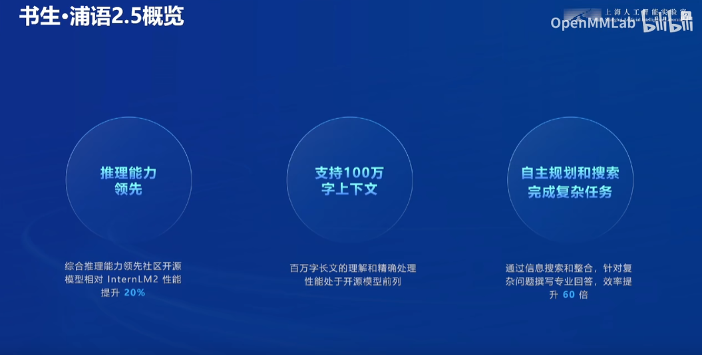

# 书生大模型全链路开源体系

在这个信息爆炸的时代，人工智能的每一次进步都如同星辰般璀璨，引领着科技的前沿。今天，我有幸观看了一段关于“书生普语大模型全链路开源体系”的详细介绍视频，这不仅是一次技术的深度剖析，更是一场对未来智能世界无限遐想的启航。

浦语的大模型体系视频：[书生·浦语大模型开源开放体系_哔哩哔哩_bilibili](https://www.bilibili.com/video/BV1CkSUYGE1v/?vd_source=38d5f9fdf2bab5cd87beccf4240f04e8)

## 视频的简要介绍

这段视频以深入浅出的方式，为我们揭开了书生普语大模型的神秘面纱。它并非传统意义上的影视剧或娱乐节目，而是一场科技盛宴的直播或教学视频，聚焦于人工智能领域的前沿技术——大模型的全链路开源体系。视频中，主讲人以饱满的热情和清晰的逻辑，引领我们穿梭于复杂的技术概念之间，让我们对书生浦语大模型有了全面而深刻的认识。

## 视频主要内容

视频内容丰富多彩，涵盖了书生普语大模型从语音识别、图像分类到多模态预训练语料库、升级版对话模型等多个方面。特别值得一提的是，书生普语不仅提供了全免费商用的7b开源模型，还构建了全链条的工具体系，支持从数据预处理到模型部署、评测的完整流程。这种全方位的开源策略，无疑为人工智能的普及和应用提供了强有力的支撑。此外，视频还展示了模型在推理数学代码、创作剧情、绘制行业趋势图等方面的强大能力，让人不禁感叹于人工智能的无限可能。

## 主题探讨

书生浦语大模型全链路开源体系的推出，不仅是对人工智能技术的一次重大贡献，更是对科技创新生态的一次深刻重塑。它打破了技术壁垒，降低了人工智能应用的门槛，使得更多的开发者、研究者能够参与到人工智能的浪潮中来。这种开放共享的精神，正是推动科技进步和社会发展的重要力量。同时，视频中也提到了人工智能在人文关怀、社会应用等方面的潜力，这让我们看到了人工智能不仅仅是冷冰冰的技术工具，更是能够温暖人心、服务社会的智慧伙伴。

## 总体评价和推荐

总的来说，这段关于书生浦语大模型全链路开源体系的视频给我留下了深刻的印象。它不仅让我对人工智能的前沿技术有了更深入的了解，还激发了我对未来智能世界的无限憧憬。视频内容充实、逻辑清晰、讲解生动，是一部不可多得的科技教育佳作。因此，我强烈推荐给所有对人工智能感兴趣的朋友观看学习。如果要用一个分数来评价的话，我愿意给出9分的高分（满分10分），因为它几乎完美地完成了知识的传递和思想的启迪。