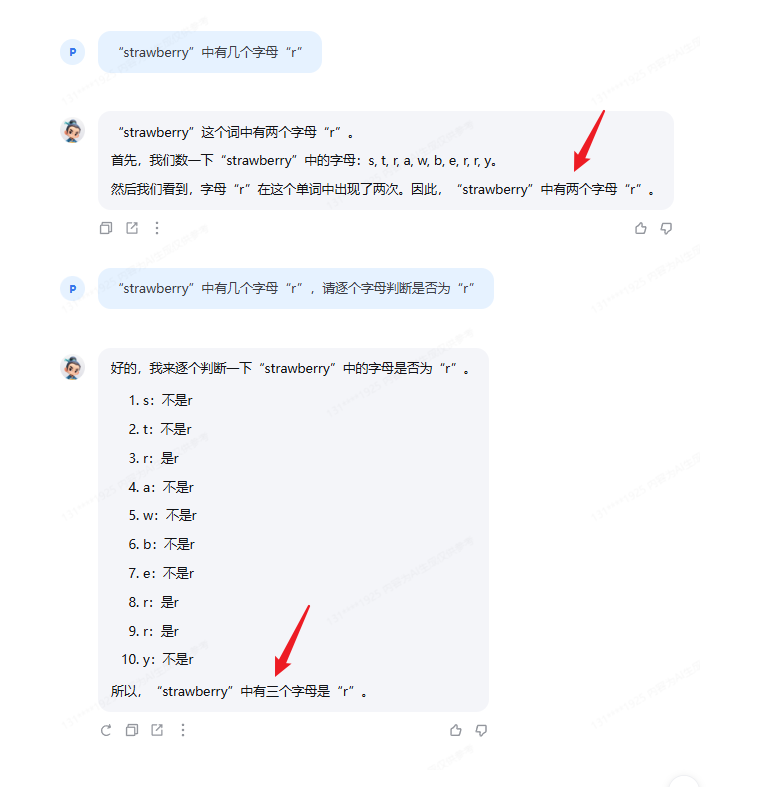

## 提示工程(Prompt Engineering)介绍

### 什么是Prompt(提示词)

Prompt是一种用于指导以大语言模型为代表的**生成式人工智能**生成内容(文本、图像、视频等)的输入方式。它通常是一个简短的文本或问题，用于描述任务和要求。

Prompt可以包含一些特定的关键词或短语，用于引导模型生成符合特定主题或风格的内容。例如，如果我们要生成一篇关于“人工智能”的文章，我们可以使用“人工智能”作为Prompt，让模型生成一篇关于人工智能的介绍、应用、发展等方面的文章。

Prompt还可以包含一些特定的指令或要求，用于控制生成文本的语气、风格、长度等方面。例如，我们可以使用“请用幽默的语气描述人工智能的发展历程”作为Prompt，让模型生成一篇幽默风趣的文章。

总之，Prompt是一种灵活、多样化的输入方式，可以用于指导大语言模型生成各种类型的内容。

###  什么是提示工程

提示工程是一种通过设计和调整输入(Prompts)来改善模型性能或控制其输出结果的技术。

在模型回复的过程中，首先获取用户输入的文本，然后处理文本特征并根据输入文本特征预测之后的文本，原理为**next token prediction**，类似我们日常使用的输入法。

提示工程是模型性能优化的基石，有以下六大基本原则：

- 指令要清晰
- 提供参考内容
- 复杂的任务拆分成子任务
- 给 LLM“思考”时间(给出过程)
- 使用外部工具
- 系统性测试变化

在提示工程中，第一点给出清晰的指令是至关重要的。一个有效的指令通常包含以下要素：背景、任务、要求、限制条件、示例、输出格式和目标。通过提供这些详细信息，我们可以引导模型生成更符合我们期望的文本。

## 基础任务

利用对提示词的精确设计，引导语言模型正确回答出“strawberry”中有几个字母“r”。

