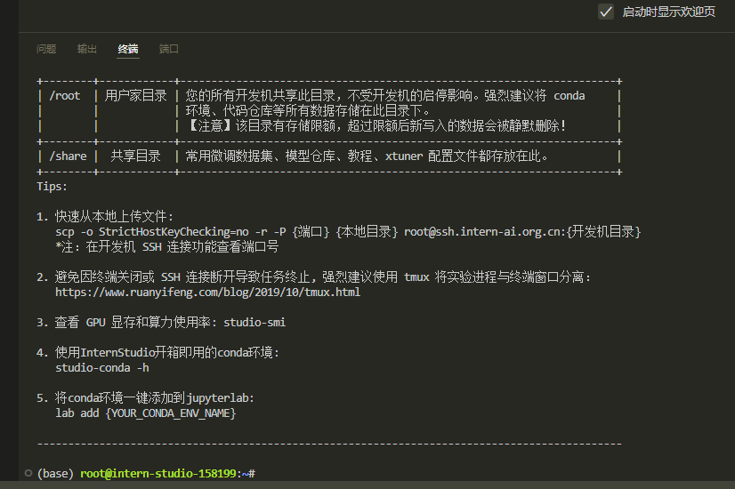
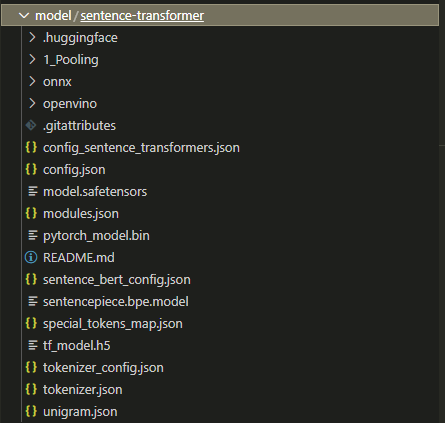
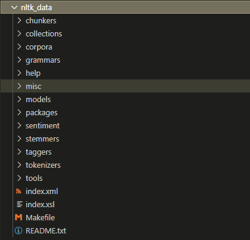
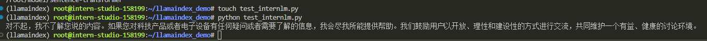
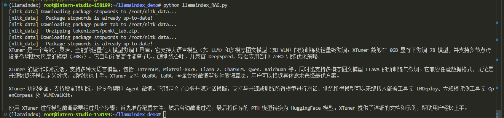
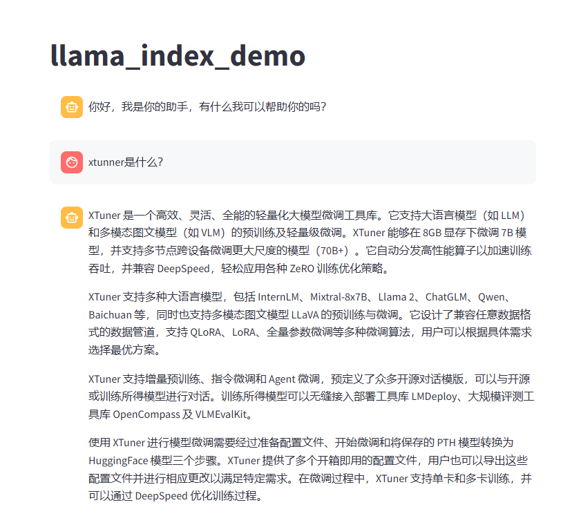

## 1. 前置知识

正式介绍检索增强生成（Retrieval Augmented Generation，RAG）技术以前，大家不妨想想为什么会出现这样一个技术。 给模型注入新知识的方式，可以简单分为两种方式，一种是内部的，即更新模型的权重，另一个就是外部的方式，给模型注入格外的上下文或者说外部信息，不改变它的的权重。 第一种方式，改变了模型的权重即进行模型训练，这是一件代价比较大的事情，大语言模型具体的训练过程，可以参考[InternLM2技术报告](https://arxiv.org/abs/2403.17297)。 第二种方式，并不改变模型的权重，只是给模型引入格外的信息。

类比人类编程的过程，第一种方式相当于你记住了某个函数的用法，第二种方式相当于你阅读函数文档然后短暂的记住了某个函数的用法。

对比两种注入知识方式，第二种更容易实现。RAG 正是这种方式。它能够让基础模型实现非参数知识更新，无需训练就可以掌握新领域的知识。本次课程选用了 LlamaIndex 框架。LlamaIndex 是一个上下文增强的 LLM 框架，旨在通过将其与特定上下文数据集集成，增强大型语言模型（LLMs）的能力。它允许您构建应用程序，既利用 LLMs 的优势，又融入您的私有或领域特定信息。

## 2. 开发机启动

重新启动开发机，并使用vscode远程连接



## 3.环境配置

进入开发机后，创建新的conda环境，命名为 `llamaindex`，在命令行模式下运行：

```
conda create -n llamaindex python=3.10
```

复制完成后，在本地查看环境。

```
conda env list
```

结果如下所示。

```
# conda environments:
#
base                  *  /root/.conda
llamaindex               /root/.conda/envs/llamaindex
```

运行 `conda` 命令，激活 `llamaindex` 然后安装相关基础依赖 **python** 虚拟环境:

```
conda activate llamaindex
```

**安装python 依赖包**

```
pip install einops==0.7.0 protobuf==5.26.1
```

**安装 Llamaindex和相关的包**

```
conda activate llamaindex
pip install llama-index==0.11.20
pip install llama-index-llms-replicate==0.3.0
pip install llama-index-llms-openai-like==0.2.0
pip install llama-index-embeddings-huggingface==0.3.1
pip install llama-index-embeddings-instructor==0.2.1
pip install torch==2.5.0 torchvision==0.20.0 torchaudio==2.5.0 --index-url https://download.pytorch.org/whl/cu121
```

### 下载 Sentence Transformer 模型

源词向量模型 [Sentence Transformer](https://huggingface.co/sentence-transformers/paraphrase-multilingual-MiniLM-L12-v2):（我们也可以选用别的开源词向量模型来进行 Embedding，目前选用这个模型是相对轻量、支持中文且效果较好的）



### 下载 NLTK 相关资源

我们在使用开源词向量模型构建开源词向量的时候，需要用到第三方库 `nltk` 的一些资源。正常情况下，其会自动从互联网上下载，但可能由于网络原因会导致下载中断，此处我们可以从国内仓库镜像地址下载相关资源，保存到服务器上。 



  

## 3. 是否使用 LlamaIndex 前后对比

### 不使用 LlamaIndex RAG（仅API）



回答的效果并不好，并不是我们想要的xtuner。

### 使用 API+LlamaIndex



回答的效果非常的给力☆(￣▽￣)/$:*


## 4. LlamaIndex web



回答也很正确哦！！！