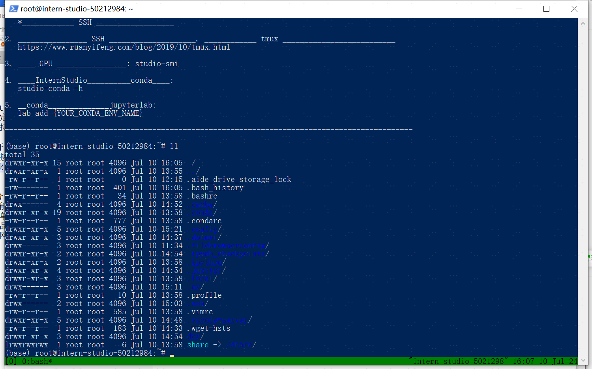

# Linux基础及环境搭建

## 环境搭建
### 1、学员信息登记并领取算力资源，新建开发机，


### 2、并安装vscode IDE，与开发机进行SSH远程连接


### 3、本地与开发机端口映射


## Linux 基础命令
### 1、熟悉linux的常用命令，通过powershell进行SSH远程登录服务器，查看显卡资源占用较低、功耗较低


### 2、备份到个人飞书文档备后续使用：https://gcng8154fkm3.feishu.cn/docx/QY1DdkV8foxKLLxE7z6cc2AJnDf

### 3、安装并使用tmux
更多tmux控制台命令参考：https://aik9.top/


## 学习conda设置及环境管理，并安装conda虚拟环境


卸载（删除）一个 conda 虚拟环境：
```
conda remove --name your_env_name --all
```


## 常用Linux命令备忘
    # 查看指定目录及其子目录的大小。 这里--max-depth=1选项限制输出只显示一级子目录的大小。
    du -h --max-depth=1 /root

## 开发机常用命令
1. 快速从本地上传文件
scp -o StrictHostKeyChecking=no -r -P {端口} {本地目录} root@ssh.intern-ai.org.cn:{开发机目录}
2. 卸载（删除）一个 conda 虚拟环境
conda remove --name your_env_name --all

