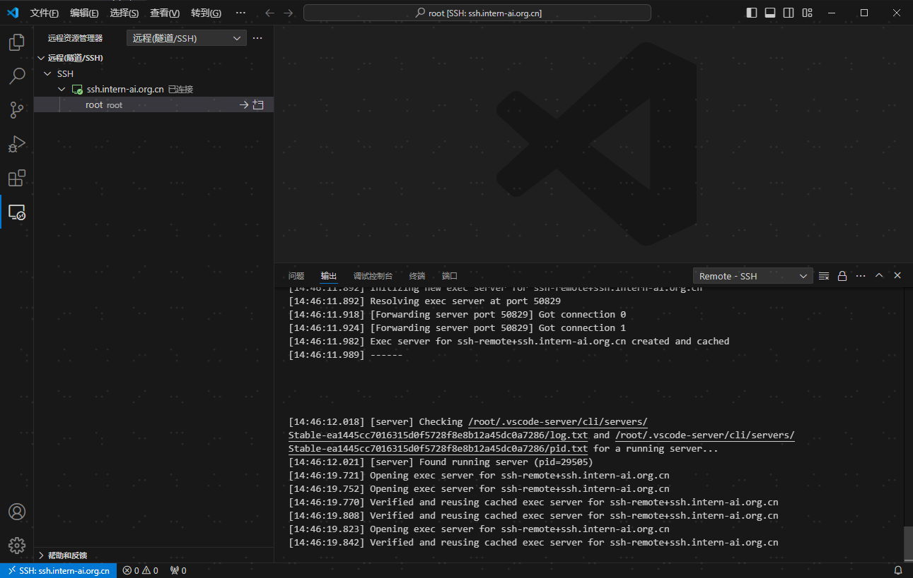
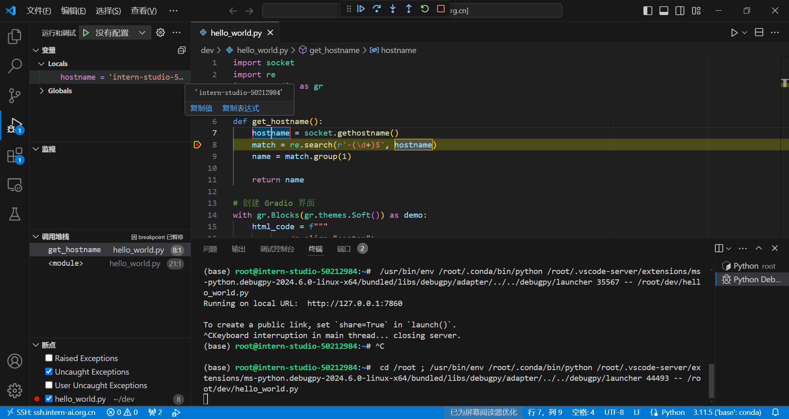
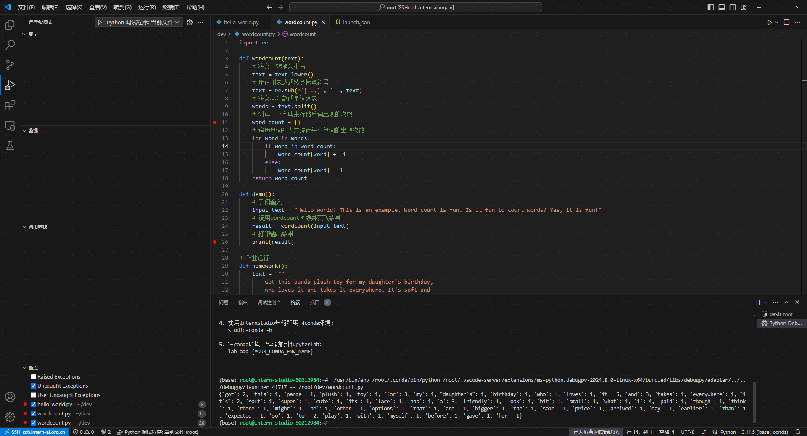

# Python

## 安装Python
推荐直接安装miniconda(anaconda也可以)来安装python，这样方便管理开发环境。
### 什么是conda？
    Conda是一个开源的软件包管理系统和环境管理系统，它主要用于安装多个版本的软件包及其依赖关系，并能轻松地在它们之间切换。以下是关于Conda的详细介绍：  
    1. 功能与作用：
  - 包管理：Conda可以帮助用户轻松地安装、更新和卸载各种软件包。它提供了一个庞大而丰富的社区仓库——Anaconda仓库，内含数千个优化过并经过验证的常见Python软件包，也包含其他编程语言（如R）的工具。
  - 环境管理：使用Conda，用户可以创建独立且隔离的开发环境，为每个项目或应用程序设置不同的版本或配置文件，确保它们之间不会相互干扰，对于处理不同的依赖关系非常重要。
  -  跨平台支持：Conda适用于Windows、Mac和Linux，使在不同平台上共享代码变得更加容易，避免由于系统差异导致的问题。  
    2. 常用命令：
  - conda list：列出当前conda环境所链接的软件包。  
  - conda create：创建一个新的conda环境。例如，conda create -n myenv python=3.8会创建一个名为myenv的新环境，并指定Python版本为3.8。  
  - conda activate：激活一个已存在的conda环境。  
  - conda deactivate：退出当前激活的环境。
  - conda install：在当前激活的环境中安装包。
  - conda update：更新包或conda本身到最新版本。
  - conda remove：从当前环境中卸载包。
  - conda env list：显示所有已创建的环境。  
    3. 适用性：
       Conda不仅为Python程序创建，也可以打包和分发其他软件，并且支持多种编程语言，包括Python、R、Ruby、Lua、Scala、Java、JavaScript、C/C++等。它被广泛用于数据分析、科学计算和机器学习领域，提供了简单而强大的工具来创建、部署和维护这些领域所需的环境。总的来说，Conda是一个在数据分析和软件开发领域非常有用的工具，特别是当需要管理多个项目和不同版本的依赖时，Conda可以大大简化环境和依赖管理的复杂性。  
### 安装
1. 安装miniconda  
    ```
     pip config set global.index-url https://pypi.tuna.tsinghua.edu.cn/simple             
2. 创建一个python练习专属的conda虚拟环境
    ```shell
    con
    conda activate python-tutorial  
    pip install jupyter lab 
    pip install numpy

    conda activate python-tutorial         
    jupyter lab  
3. 使用本地Vscode远程连接InternStudio开发机  
  
4. 运行调试
  


## 作业
### 1. 请用Python实现一个wordcount函数，统计英文字符串中每个单词出现的次数。返回一个字典，key为单词，value为对应单词出现的次数。
[代码传送门](wordcount.py)  
运行结果：

### 2. 请使用本地vscode连接远程开发机，将上面你写的wordcount函数在开发机上进行debug，体验debug的全流程，并完成一份debug笔记(需要截图)。

