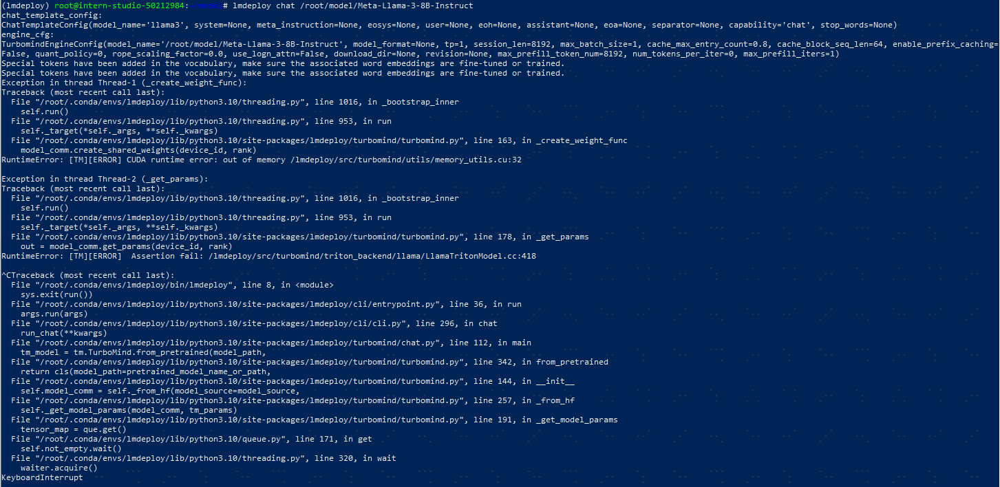

# 书生·浦语大模型全链路开源体系

## 1 书生·浦语大模型体系简介
### 1.1 书生·浦语大模型开源历程

### 1.2 书生·浦语大模型全链路开源体系

OpenXLab模型中心：https://openxlab.org.cn/models


多模态大模型InternLM-XComposer：可以进行图文创作和多模态对话两种用途

开源数据处理工具箱

### 1.3 模型应用开发流程

### 1.4 开源数据集

### 1.5 预训练&微调


### 1.6 模型评测OpenCompass


### 1.7 模型部署LMDeploy
https://lmdeploy.readthedocs.io/zh-cn/latest/index.html

### 1.8 轻量级智能体框架Lagent


## 2 开发及模型部署环境 & LMDeploy部署Llama3
本节参考资料：https://github.com/SmartFlowAI/Llama3-Tutorial/blob/main/docs/lmdeploy.md
后来出的材料（Llama3 部署+微调实践）待实操：https://mp.weixin.qq.com/s/cZkcu2npvb0p_kwQahp24g 
后来出的llama3.1原生支持fuctioncalling 待实操：https://github.com/InternLM/lmdeploy/blob/main/docs/en/serving/api_server_tools.md
### 2.1 创建开发机 （部署前升级至30% A100）

### 2.2 环境配置
    # 如果你是InternStudio 可以直接使用
    # studio-conda -t lmdeploy -o pytorch-2.1.2
    # 初始化环境
    conda create -n lmdeploy python=3.10
    conda activate lmdeploy
    conda env list #查看虚拟环境
    conda info -e #还是查看虚拟环境
    conda install pytorch==2.1.2 torchvision==0.16.2 torchaudio==2.1.2 pytorch-cuda=12.1 -c pytorch -c nvidia
### 2.3 安装最新版LMDeploy
    pip install -U lmdeploy[all]
### 2.4 下载Llama3
```shell
# 新建文件夹
mkdir -p ~/model
cd ~/model
# 软链接 InternStudio 中的模型
ln -s /root/share/new_models/meta-llama/Meta-Llama-3-8B-Instruct ~/model/Meta-Llama-3-8B-Instruct
# （非InternStudio环境）下载模型 
# git clone https://code.openxlab.org.cn/MrCat/Llama-3-8B-Instruct.git Meta-Llama-3-8B-Instruct
```
### 2.5 部署Llama3
```shell
# 通过LMDeploy-Chat-CLI工具运行
lmdeploy chat /root/model/Meta-Llama-3-8B-Instruct
```
直接部署会报错，原因是CUDA运行时显存不足错误，错误如下：

升级开发机配置至30% A100 再次运行，成功部署：

### 2.6 通过api_server方式运行Llama3
```shell
# 本地终端运行端口映射： ssh -CNg -L 9997:127.0.0.1:9997 root@ssh.intern-ai.org.cn -p 48466
lmdeploy serve api_server \
    /root/model/Meta-Llama-3-8B-Instruct \
    --model-format hf \
    --quant-policy 0 \
    --server-name 0.0.0.0 \
    --server-port 9997 \
    --tp 1
```

### 2.7 使用LMDeploy运行视觉多模态大模型Llava-Llama-3
1、 安装依赖
```shell
pip install git+https://github.com/haotian-liu/LLaVA.git
```
2、 运行模型
运行touch /root/pipeline_llava.py 新建一个文件夹，复制下列代码进去
```python
from lmdeploy import pipeline, ChatTemplateConfig
from lmdeploy.vl import load_image
pipe = pipeline('xtuner/llava-llama-3-8b-v1_1-hf',
                chat_template_config=ChatTemplateConfig(model_name='llama3'))

image = load_image('https://raw.githubusercontent.com/open-mmlab/mmdeploy/main/tests/data/tiger.jpeg')
response = pipe(('describe this image', image))
print(response.text)
```

## 3 Xinference部署模型demo 
### 3.1 conda环境
- conda create -n xinference python=3.10  #创建虚拟环境
- bash  #进入bash shells
- conda activate xinference  #激活虚拟环境
- conda deactivate  #退出虚拟环境
- conda remove -n xinference --all  #删除虚拟环境
- conda env list
- nvidia-smi  #显卡运行情况查看

### 3.2 Xinference配置项
    # 修改存储目录（模型及日志文件）
    export XINFERENCE_HOME=/tmp/xinference
    # 可以使用的显卡（使用nvidia-smi查看）
    export CUDA_VISIBLE_DEVICES=0,1,2,3,4
    # 从modelscopde下载模型
    export XINFERENCE_MODEL_SRC=modelscope
    # 设置token(部分模型需要授权)
    export HUGGING_FACE_HUB_TOKEN=your_token_here
    # 模型缓存目录，默认值是~/.cache/modelscope/hub
    export MODELSCOPE_CACHE=<model_saved_path>
### 3.3 Xinference常用命令
    # 查看支持的某种类型所有模型（LLM/embedding/image/audio/rerank）
    xinference registrations -t LLM
    # 查看在运行的模型
    xinference list
    # 终止某个模型
    xinference terminate --model-uid "my-llama-2"
    # 重启
    ps -ef | grep xinference | grep -v grep | awk '{print $2}' | xargs kill -9
    ps -ef | grep xinference | grep -v grep | wc -l
### 3.4 Xinference使用vLLM加速
LLM 是一个支持高并发的高性能大模型推理引擎。当满足以下条件时，Xinference 会自动选择 vllm 作为引擎来达到更高的吞吐量：
- 模型格式为 pytorch ， gptq 或者 awq 。
- 当模型格式为 pytorch 时，量化选项需为 none 。
- 当模型格式为 gptq 或 awq 时，量化选项需为 Int4 。
- 操作系统为 Linux 并且至少有一个支持 CUDA 的设备
- 自定义模型的 model_family 字段和内置模型的 model_name 字段在 vLLM 的支持列表中。
### 3.5 从ModelScope下载模型（可选）
执行 MODELSCOPE_CACHE=/data/modelscope/hub 改变缓存目录，默认值是~/.cache/modelscope/hub  

    mkdir -p /data/modelscope/hub
    cd /data/modelscope/hub
    pip install modelscope   
    python
    from modelscope import snapshot_download
    model_dir = snapshot_download('qwen/Qwen1.5-32B-Chat-AWQ', cache_dir='/data/modelscope/hub')
### 3.6 安装部署
    # 1. 安装
    pip install "xinference[all]"

    # 2. 启动
    # 默认情况下，Xinference 会使用 <HOME>/.xinference 作为主目录来存储一些必要的信息，比如日志文件和模型文件
    xinference-local --host 0.0.0.0 --port 9997

    # 3. 本地终端运行端口映射命令
    ssh -p 48466 root@ssh.intern-ai.org.cn -CNg -L 9997:127.0.0.1:9997 -o StrictHostKeyChecking=no
访问http://localhost:9997/， 端口映射后本地成功访问xinference-ui 

以下是启动运行调试结果，首次问题响应会比较慢， 后续很快


模型启动有一些限制，好几次部署失败的，需要后续熟悉具体参数的含义

    # 3. 也可以使用命令行运行模型（不指定-u/--model-uid会随机生成一个）
    # -u --model-uid 不指定会自动生成一个唯一id（默认跟模型名一样）
    # -n --model-name 模型名
    # -f model format
    # -s 模型大小（billions）
    # -e --endpoint xinference地址
    # -r --replica 副本数
    # --n-gpu 使用多少个gpu
    # 在使用具体的加速框架时，可以增加对应的参数，如vllm支持的--max_model_len 8192
    xinference launch -u my-llama-2 -n llama-2-chat -s 13 -f pytorch -r 1 --n-gpu 2 --gpu-idx 3,4

## 4 ollama安装

通过ollama运行Qwen2（https://github.com/QwenLM/Qwen2?tab=readme-ov-file）
```shell
ollama serve
# You need to keep this service running whenever you are using ollama
ollama run qwen2:7b
# To exit, type "/bye" and press ENTER
```