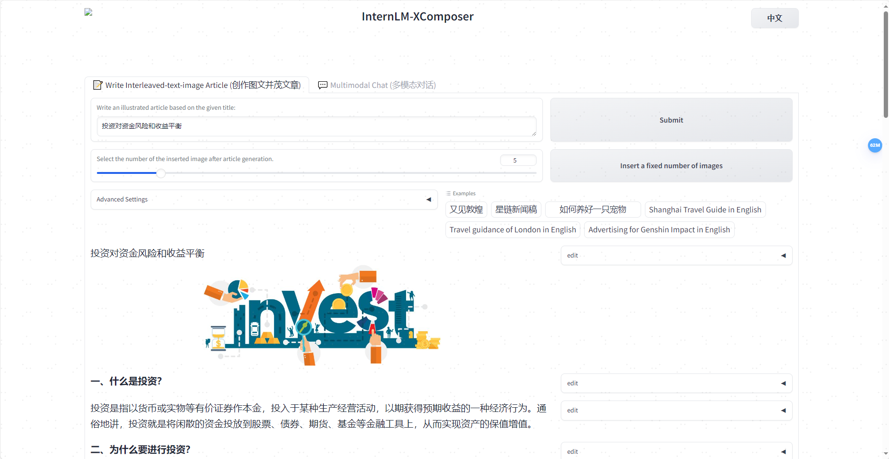

# 轻松玩转书生·浦语大模型趣味 Demo

## 1 大模型及 InternLM 模型简介
### 1.1 大模型简介
大模型，全称「大语言模型」，英文「Large Language Model」，缩写「LLM」。  
大模型的优势在于其能够捕捉和理解数据中更为复杂、抽象的特征和关系。按格式输出、分类聚类、生成文本、翻译、问答、对话等任务，大模型都能表现出色。大模型的应用场景非常广泛，包括但不限于：  
- 自然语言处理：如机器翻译、文本生成、情感分析、问答系统等。  
- 计算机视觉：如图像识别、物体检测、图像生成等。  
- 语音识别：如语音转文字、语音合成等。  
通过大规模参数的学习，它们可以提高在各种任务上的泛化能力，并在未经过大量特定领域数据训练的情况下实现较好的表现。然而，大模型也面临着一些挑战，比如巨大的计算资源需求、高昂的训练成本、对大规模数据的依赖以及模型的可解释性等问题。因此，大模型的应用和发展也需要在性能、成本和道德等多个方面进行权衡和考量。
### 1.2 大模型的运行机制
大模型根据上文及上上文及上上文的结果，猜下一个词（的概率），目前主流模型的算法采用 transformer，我们问问题的时候可以发现各种chat都是一个字一个字的返回

### 1.3 InternLM 模型简介
InternLM 是一个开源的轻量级训练框架，旨在支持大模型训练而无需大量的依赖。通过单一的代码库，它支持在拥有数千个 GPU 的大型集群上进行预训练，并在单个 GPU 上进行微调，同时实现了卓越的性能优化。在 1024 个 GPU 上训练时，InternLM 可以实现近 90% 的加速效率。  
基于 InternLM 训练框架，上海人工智能实验室已经发布了两个开源的预训练模型：InternLM-7B 和 InternLM-20B。

### 1.4 Lagent 简介
Lagent 是一个轻量级、开源的基于大语言模型的智能体（agent）框架，支持用户快速地将一个大语言模型转变为多种类型的智能体，并提供了一些典型工具为大语言模型赋能。通过 Lagent 框架可以更好的发挥 InternLM 的全部性能。


## 2 通用环境配置
### 2.1 pip、conda 换源
更多详细内容可移步至 [MirrorZ Help](https://help.mirrors.cernet.edu.cn/) 查看。
- 2.1.1 pip 换源
临时使用镜像源安装，如下所示：some-package 为你需要安装的包名
```bash
pip install -i https://mirrors.cernet.edu.cn/pypi/web/simple some-package
```
设置pip默认镜像源，升级 pip 到最新的版本 (>=10.0.0) 后进行配置，如下所示：
```bash
python -m pip install --upgrade pip
pip config set global.index-url https://mirrors.cernet.edu.cn/pypi/web/simple
```
如果您的 pip 默认源的网络连接较差，临时使用镜像源升级 pip：
```bash
python -m pip install -i https://mirrors.cernet.edu.cn/pypi/web/simple --upgrade pip
```
- 2.1.2 conda 换源  
镜像站提供了 Anaconda 仓库与第三方源（conda-forge、msys2、pytorch 等），各系统都可以通过修改用户目录下的 .condarc 文件来使用镜像站。  
不同系统下的 .condarc 目录如下：
    - Linux: ${HOME}/.condarc
    - macOS: ${HOME}/.condarc
    - Windows: C:\Users\<YourUserName>\.condarc  

    注意：Windows 用户无法直接创建名为 .condarc 的文件，可先执行 conda config --set show_channel_urls yes 生成该文件之后再修改。
    快速配置
    ```
    cat <<'EOF' > ~/.condarc
    channels:
    - defaults
    show_channel_urls: true
    default_channels:
    - https://mirrors.tuna.tsinghua.edu.cn/anaconda/pkgs/main
    - https://mirrors.tuna.tsinghua.edu.cn/anaconda/pkgs/r
    - https://mirrors.tuna.tsinghua.edu.cn/anaconda/pkgs/msys2
    custom_channels:
    conda-forge: https://mirrors.tuna.tsinghua.edu.cn/anaconda/cloud
    pytorch: https://mirrors.tuna.tsinghua.edu.cn/anaconda/cloud
    EOF
    ```
### 2.2 配置本地端口
由于服务器通常只暴露了用于安全远程登录的 SSH（Secure Shell）端口，如果需要访问服务器上运行的其他服务（如 web 应用）的特定端口，需要一种特殊的设置。我们可以通过使用SSH隧道的方法，将服务器上的这些特定端口映射到本地计算机的端口。这样做的步骤如下：  

首先我们需要配置一下本地的 SSH Key ，我们这里以 Windows 为例。

步骤①：在本地机器上打开 Power Shell 终端。在终端中，运行以下命令来生成 SSH 密钥对：（如下图所示）
```bash
ssh-keygen -t rsa
```
步骤②： 您将被提示选择密钥文件的保存位置，默认情况下是在 ~/.ssh/ 目录中。按 Enter 键接受默认值或输入自定义路径。

步骤③：公钥默认存储在 ~/.ssh/id_rsa.pub，可以通过系统自带的 cat 工具查看文件内容：（如下图所示）
```bash
cat ~\.ssh\id_rsa.pub
```
    ~ 是用户主目录的简写，.ssh 是SSH配置文件的默认存储目录，id_rsa.pub 是 SSH 公钥文件的默认名称。所以，cat ~\.ssh\id_rsa.pub 的意思是查看用户主目录下的 .ssh 目录中的 id_rsa.pub 文件的内容。

步骤④：将公钥复制到剪贴板中，然后回到 InternStudio 控制台，点击配置 SSH Key。将刚刚复制的公钥添加进入即可。
步骤⑥：在本地终端输入以下指令 .6006 是在服务器中打开的端口，而 33090 是根据开发机的端口进行更改。如下图所示：
```bash
ssh -CNg -L 6006:127.0.0.1:6006 root@ssh.intern-ai.org.cn -p 33090
```

### 2.3 模型下载
实验室环境root/share下准备了很多常用开源模型，主要在new_models、temp/model_repos两个子包下，直接复制使用即可，例如：
```bash
mkdir -p /root/model/Shanghai_AI_Laboratory
cp -r /root/share/temp/model_repos/internlm-chat-7b /root/model/Shanghai_AI_Laboratory
```
#### 2.3.1 Hugging Face
使用 Hugging Face 官方提供的 huggingface-cli 命令行工具。安装依赖:
```bash
pip install -U huggingface_hub
```
然后新建 python 文件，填入以下代码，运行即可。
- resume-download：断点续下
- local-dir：本地存储路径。（linux 环境下需要填写绝对路径）
```python
import os

# 下载模型
os.system('huggingface-cli download --resume-download internlm/internlm-chat-7b --local-dir your_path')
```
以下内容将展示使用 huggingface_hub 下载模型中的部分文件
```python
import os 
from huggingface_hub import hf_hub_download  # Load model directly 

hf_hub_download(repo_id="internlm/internlm-7b", filename="config.json")
```
#### 2.3.2 ModelScope
使用 modelscope 中的 snapshot_download 函数下载模型，第一个参数为模型名称，参数 cache_dir 为模型的下载路径。  
注意：cache_dir 最好为绝对路径。  
安装依赖：
```bash
pip install modelscope==1.9.5
pip install transformers==4.35.2
```
在当前目录下新建 python 文件，填入以下代码，运行即可。
```python
import torch
from modelscope import snapshot_download, AutoModel, AutoTokenizer
import os
model_dir = snapshot_download('Shanghai_AI_Laboratory/internlm-chat-7b', cache_dir='your path', revision='master')
```
#### 2.3.3 OpenXLab 
OpenXLab （https://openxlab.org.cn/models） 可以通过指定模型仓库的地址，以及需要下载的文件的名称，文件所需下载的位置等，直接下载模型权重文件。  

使用python脚本下载模型首先要安装依赖，安装代码如下：pip install -U openxlab 安装完成后使用 download 函数导入模型中心的模型。
```python
from openxlab.model import download
download(model_repo='OpenLMLab/InternLM-7b', model_name='InternLM-7b', output='your local path')
```

## 3 模型部署实践案例demo
### 3.1 InternLM-Chat-7B 智能对话 Demo
- 环境准备：
```bash
bash # 请每次使用 jupyter lab 打开终端时务必先执行 bash 命令进入 bash 中
bash /root/share/install_conda_env_internlm_base.sh internlm-demo  # 执行该脚本文件来安装项目实验环境

conda activate internlm-demo

# 并在环境中安装运行 demo 所需要的依赖。
python -m pip install --upgrade pip

pip install modelscope==1.9.5
pip install transformers==4.35.2
pip install streamlit==1.24.0
pip install sentencepiece==0.1.99
pip install accelerate==0.24.1
```
- 模型下载：
```bash
mkdir -p /root/model/Shanghai_AI_Laboratory
cp -r /root/share/temp/model_repos/internlm-chat-7b /root/model/Shanghai_AI_Laboratory
```
- 准备代码：
```bash
cd /root/code
git clone https://gitee.com/internlm/InternLM.git

# 切换 commit 版本，与教程 commit 版本保持一致，可以让大家更好的复现。
cd InternLM
git checkout 3028f07cb79e5b1d7342f4ad8d11efad3fd13d17
```
将 /root/code/InternLM/web_demo.py 中 29 行和 33 行的模型更换为本地的 /root/model/Shanghai_AI_Laboratory/internlm-chat-7b。  
  
- 终端运行：
修改 /root/code/InternLM 目录下的 cli_demo.py文件：
```python
model_name_or_path = "/root/model/Shanghai_AI_Laboratory/internlm-chat-7b"
```
然后在终端运行python脚本（python /root/code/InternLM/cli_demo.py），即可体验 InternLM-Chat-7B 模型的对话能力。对话效果如下所示：

- web_demo运行：
```bash
streamlit run /root/code/lagent/examples/react_web_demo.py --server.address 127.0.0.1 --server.port 6006
```
将6006端口映射到本地。在本地浏览器输入 http://127.0.0.1:6006 即可体验 InternLM-Chat-7B 智能对话 Demo。（访问才会下载模型，首次访问需要等大概5-10分钟）运行结果：

### 3.2 Lagent 智能体工具调用 Demo
- 首先完成3.2章节安装部署模型
- 切换路径到 /root/code 克隆 lagent 仓库，并通过 pip install -e . 源码安装 Lagent
```bash
cd /root/code
git clone https://gitee.com/internlm/lagent.git
cd /root/code/lagent
git checkout 511b03889010c4811b1701abb153e02b8e94fb5e # 尽量保证和教程commit版本一致
pip install -e . # 源码安装
```
- 修改代码
由于代码修改的地方比较多，参考：https://github.com/InternLM/tutorial/blob/camp1/helloworld/hello_world.md#34-%E4%BF%AE%E6%94%B9%E4%BB%A3%E7%A0%81  
- Demo运行
```bash
streamlit run /root/code/lagent/examples/react_web_demo.py --server.address 127.0.0.1 --server.port 6006
```
将6006端口映射到本地。在本地浏览器输入 http://127.0.0.1:6006 即可体验 Lagent 智能体工具调用 Demo。运行结果：

遗漏源码安装步骤，报错了一次：


### 3.4 浦语·灵笔图文理解创作 Demo
- 环境准备  
首先在 InternStudio 上创建并启动A100*50% 开发机。然后初始化conda环境：
```bash
/root/share/install_conda_env_internlm_base.sh xcomposer-demo
conda activate xcomposer-demo
pip install transformers==4.33.1 timm==0.4.12 sentencepiece==0.1.99 gradio==3.44.4 markdown2==2.4.10 xlsxwriter==3.1.2 einops accelerate
```
- 模型下载  
```bash
cp -r /root/share/temp/model_repos/internlm-xcomposer-7b /root/model/Shanghai_AI_Laboratory
```
- 代码准备  
```bash
cd /root/code
git clone https://gitee.com/internlm/InternLM-XComposer.git
cd /root/code/InternLM-XComposer
git checkout 3e8c79051a1356b9c388a6447867355c0634932d  # 最好保证和教程的 commit 版本一致
```
- Demo运行  
在终端运行以下代码：
```bash
cd /root/code/InternLM-XComposer
python examples/web_demo.py  \
    --folder /root/model/Shanghai_AI_Laboratory/internlm-xcomposer-7b \
    --num_gpus 1 \
    --port 6006
```
这里 num_gpus 1 是因为InternStudio平台对于 A100(1/4)*2 识别仍为一张显卡。但如果有小伙伴课后使用两张 3090 来运行此 demo，仍需将 num_gpus 设置为 2 。
将端口映射到本地(本地终端运行 ssh -CNg -L 6006:127.0.0.1:6006 root@ssh.intern-ai.org.cn -p 39192 )。在本地浏览器输入 http://127.0.0.1:6006 即可。
- 体验图文创作的功能:

创作功能初步试用比较适用，功能狠方便。  
  
- 体验图片理解的能力:
  
图片理解能力较弱，只能识别主要地标性建筑或者特征比较明显的人或物，对于细节或者更适用的关键信息提取json则完全不可用。  
  
30%A100运行时资源不够报错：

  
## 4 作业 - 基础任务
使用 LMDeploy 完成 InternLM2-Chat-1.8B 模型的部署，并生成 300 字小故事，记录复现过程并截图。
### 4.1 实验室环境准备
每次启动环境运行需执行的命令：
```bash
bash # 请每次使用 jupyter lab 打开终端时务必先执行 bash 命令进入 bash 中
bash /root/share/install_conda_env_internlm_base.sh internlm-demo  # 执行该脚本文件来安装项目实验环境

conda activate internlm-demo

# 并在环境中安装运行 demo 所需要的依赖。
python -m pip install --upgrade pip

pip install modelscope==1.9.5
pip install transformers==4.35.2
pip install streamlit==1.24.0
pip install sentencepiece==0.1.99
pip install accelerate==0.24.1
```
### 4.2 模型下载
参考上述2.3章节，本次采用实验室下载，在 /root 路径下新建目录 model，在目录下新建 download.py 文件并在其中输入以下内容，粘贴代码后记得保存文件，如下图所示。并运行 python /root/model/download.py 执行下载
```python
import os
os.system('huggingface-cli download --resume-download internlm/internlm-chat-1.8b --local-dir /root/model')
```


### 4.3 代码准备
首先 clone 代码，在 /root 路径下新建 code 目录，然后切换路径, clone 代码.
```bash
cd /root/code
git clone https://gitee.com/internlm/InternLM.git
```
将 /root/code/InternLM/web_demo.py 中 29 行和 33 行的模型更换为本地的 /root/model/Shanghai_AI_Laboratory/internlm2-chat-1_8b
### 4.4 终端运行
我们可以在 /root/code/InternLM 目录下新建一个 cli_demo.py 文件，将以下代码填入其中：
```python
import torch
from transformers import AutoTokenizer, AutoModelForCausalLM


model_name_or_path = "/root/model/Shanghai_AI_Laboratory/internlm2-chat-1_8b"

tokenizer = AutoTokenizer.from_pretrained(model_name_or_path, trust_remote_code=True)
model = AutoModelForCausalLM.from_pretrained(model_name_or_path, trust_remote_code=True, torch_dtype=torch.bfloat16, device_map='auto')
model = model.eval()

system_prompt = """You are an AI assistant whose name is InternLM (书生·浦语).
- InternLM (书生·浦语) is a conversational language model that is developed by Shanghai AI Laboratory (上海人工智能实验室). It is designed to be helpful, honest, and harmless.
- InternLM (书生·浦语) can understand and communicate fluently in the language chosen by the user such as English and 中文.
"""

messages = [(system_prompt, '')]

print("=============Welcome to InternLM chatbot, type 'exit' to exit.=============")

while True:
    input_text = input("User  >>> ")
    input_text = input_text.replace(' ', '')
    if input_text == "exit":
        break
    response, history = model.chat(tokenizer, input_text, history=messages)
    messages.append((input_text, response))
    print(f"robot >>> {response}")
```
在终端通过python脚本执行该文件(python cli_demo.py)，即可体验 internlm2-chat-1.8b 模型的对话能力。对话效果如下所示：

### 4.5 web demo 运行
我们切换到 VScode 中，运行 /root/code/InternLM 目录下的 web_demo.py 文件，输入以下命令运行。
```bash
bash
conda activate internlm-demo  # 首次进入 vscode 会默认是 base 环境，所以首先切换环境
cd /root/code
git clone https://github.com/InternLM/Tutorial.git

streamlit run /root/code/Tutorial/tools/streamlit_demo.py --server.address 127.0.0.1 --server.port 6006
```

查看本教程5.2配置本地端口，将端口映射到本地。
```bash
ssh -CNg -L 6006:127.0.0.1:6006 root@ssh.intern-ai.org.cn -p 39192
```
在本地浏览器输入 http://127.0.0.1:6006 即可在本地访问远程web服务。

internlm2-chat-1.8b 不是很稳定，有时候会错误回答


## 5 作业 - 进阶任务1
使用 LMDeploy 完成 InternLM-XComposer2-VL-1.8B 的部署，并完成一次图文理解对话，记录复现过程并截图。
### 5.1 环境准备
首先在 InternStudio 上创建并启动A100*30% 开发机。然后初始化conda环境：
```bash
bash /root/share/install_conda_env_internlm_base.sh xcomposer-demo
conda activate xcomposer-demo

pip install lmdeploy[all]==0.5.1
pip install timm==1.0.7
```

### 5.2 Demo运行  
使用 LMDeploy 启动一个与 InternLM-XComposer2-VL-1.8B 模型交互的 Gradio 服务：
```bash
lmdeploy serve gradio /share/new_models/Shanghai_AI_Laboratory/internlm-xcomposer2-vl-1_8b --cache-max-entry-count 0.1
```
运行internlm-xcomposer2-vl-1_8b成功：

配置端口映射后，使用浏览器访问 http://127.0.0.1:6006 即可在本地访问远程web服务。  
对话时报错，进程直接关闭，暂时未排查出原因：


## 6 作业 - 进阶任务2
使用 LMDeploy 完成 InternVL2-2B 的部署，并完成一次图文理解对话，记录复现过程并截图。
### 6.1 进入上一步创建的xcomposer-demo环境
首先在 InternStudio 上创建并启动A100*30% 开发机。然后初始化conda环境：
```bash
conda activate xcomposer-demo
pip install flash-attention transformers
```
### 6.4 Demo运行  
在终端运行以下代码：
```bash
lmdeploy serve gradio /share/new_models/OpenGVLab/InternVL2-2B --cache-max-entry-count 0.1
```
在完成端口映射后，我们便可以通过浏览器访问 http://localhost:6006 来启动我们的 Demo。


问答会报错，直接退出进程了， 升级显存到30%A100问题依然存在，控制台日志如下：
