# llamaindex+Internlm2 RAG实践
参考学习资料：https://github.com/InternLM/Tutorial/tree/camp3/docs/L1/LlamaIndex

## 1 检索增强生成RAG（Retrieval Augmented Generation）
### 1.1 RAG技术概述
RAG技术是根据问题从知识库中检索背景知识，以辅助大语言模型生成答案。RAG允许对新增数据部分使用相同的模型处理，而无需调整及微调模型，从而极大地拓展了大模型的可用性。同时RAG可以保护用户的私域数据，避免数据外泄。
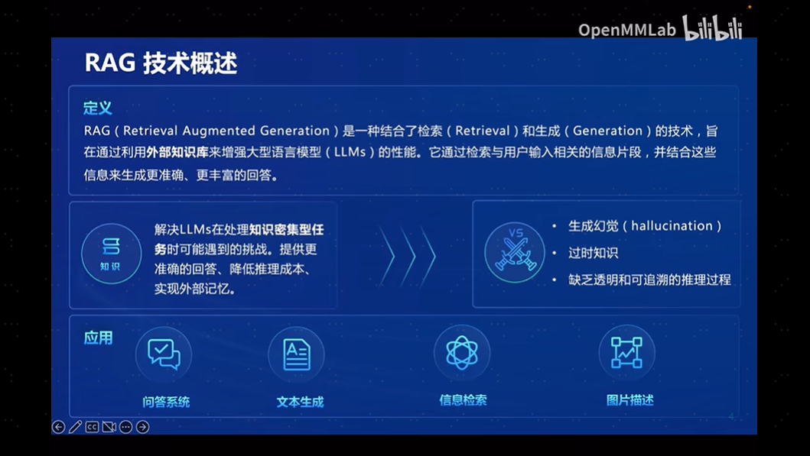
主要解决大模型当前的一些局限性:
- 幻觉问题：LLM 文本生成的底层原理是基于概率的 token by token 的形式，因此会不可避免地产生“一本正经的胡说八道”的情况。
- 垂域知识不足：大模型通过预训练获得通用语言能力，但不具备专业领域的知识。对某些专业问题无法做出准确回答。
- 记忆力有限：大语言模型参数量虽然很大，但仍然无法记住大量具体的事实知识。容易在需要记忆的任务上表现不佳。
- 时效性问题：大语言模型的规模越大，大模型训练的成本越高，周期也就越长。那么具有时效性的数据也就无法参与训练，所以也就无法直接回答时效性相关的问题，例如“帮我推荐几部热映的电影？”。
- 数据安全问题：通用大语言模型没有企业内部数据和用户数据，那么企业想要在保证安全的前提下使用大语言模型，最好的方式就是把数据全部放在本地，企业数据的业务计算全部在本地完成。而在线的大模型仅仅完成一个归纳的功能  
  
RAG技术的发展进程：
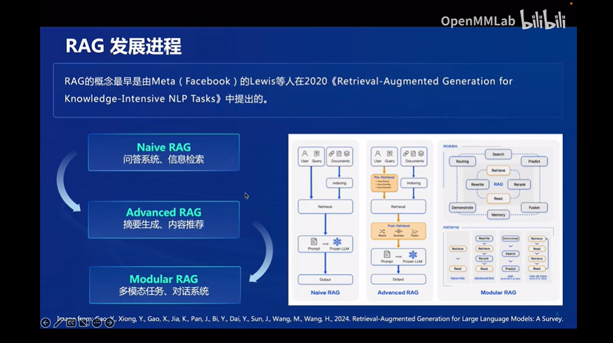

### 1.2 RAG工作原理
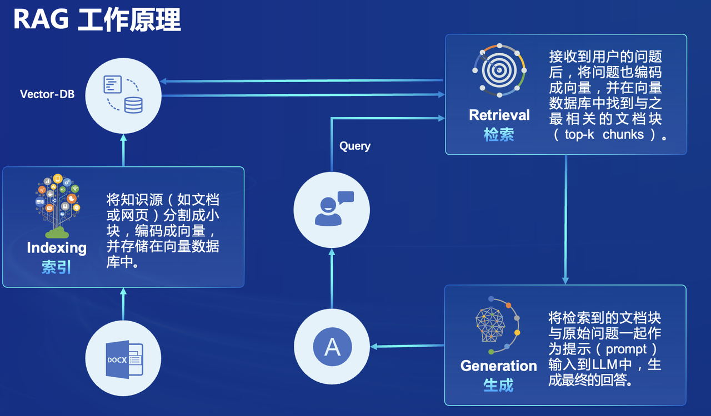
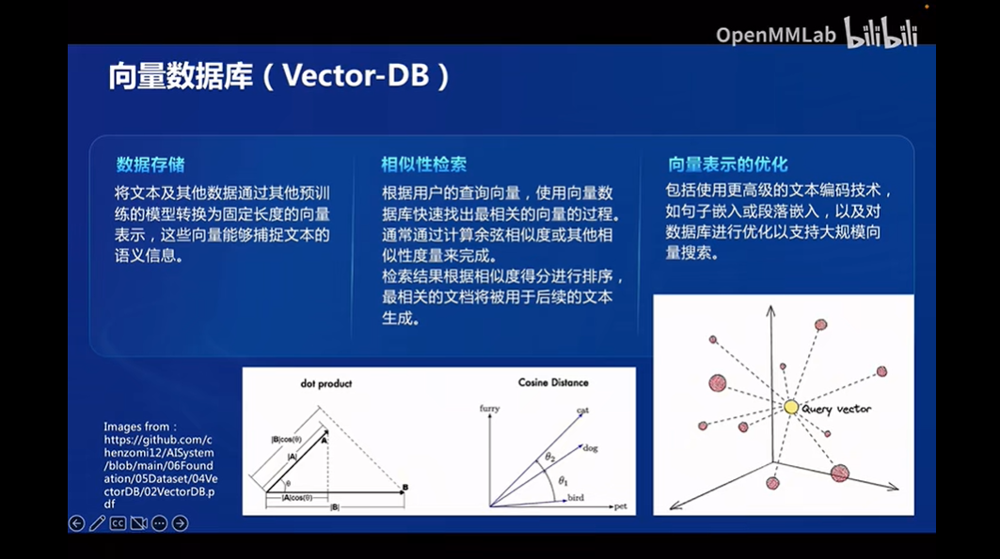

### 1.3 RAG完整流程
RAG 的基本操作流程：
>离线步骤：文档加载->切分->向量化->灌库  
在线步骤：问题->向量化->检索->Prompt→LLM→回复
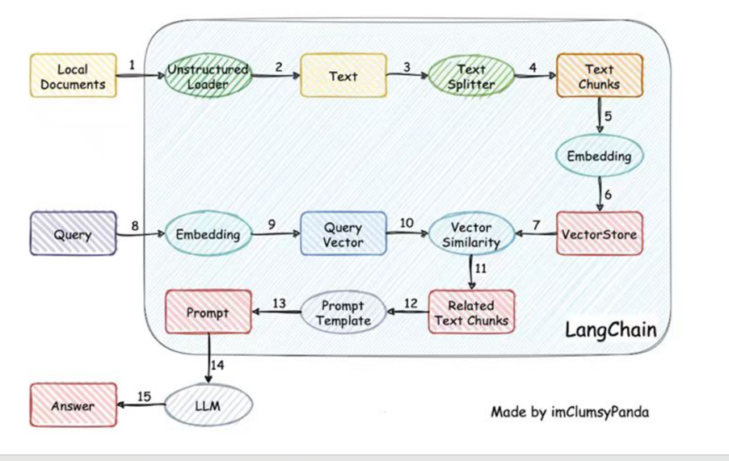

### 1.4 RAG优化
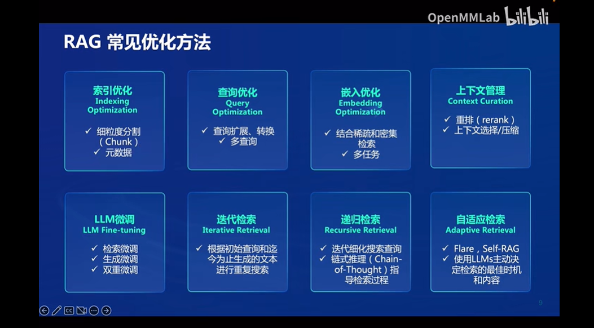
1. Prompt优化  
prompt很重要，同一个语义，用词不同，可能导致检索不到有效的结果。
2. Embedding模型微调  
开源商业embedding模型基于通用语料训练，对私域数据通常表现不佳，微调embedding模型是一种非常经济的RAG表现增强方案。
3. Reranker模型  
embedding模型虽能够在给定的top_k内召回文本块，但目标文本块的位置并非top1，导致组织为prompt时，目标文本处于完整prompt的中间位置。  
通过Reranker模型可以对召回文档进行重排，获得更精细的相关性得分，从而使目标文档的位置靠前。
4. 多路召回  
- 针对不同的数据源进行检索，如文本关键字检索、向量检索、搜索引擎检索、图数据库检索、关系数据库检索，将检索的结果进行重排。
- 多路召回可以有效丰富prompt的事实性和多样性，降低幻觉的可能性，但对prompt模板的质量、大模型的推理能力和重排算法的效果提出了更高的要求。
- 文本关键字检索、向量检索、搜索引擎检索主要瓶颈在重排算法的效果，而图数据库检索、关系数据库检索则非常依赖大模型的代码生成能力。
5. 元数据标注  
meta-data:在被检索数据中加入标题、页码、日期等meta-data可以执行进一步的过滤，提高召回数据的精准度。根据每块分块数据提取摘要数据当作元数据查询。

### 1.5 RAG VS 微调（Fine-tuning）
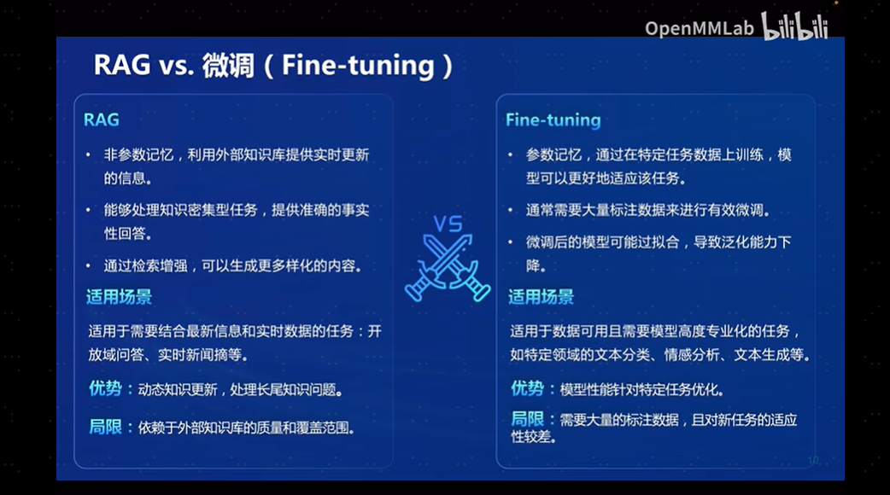
LLM大模型优化方法比较：
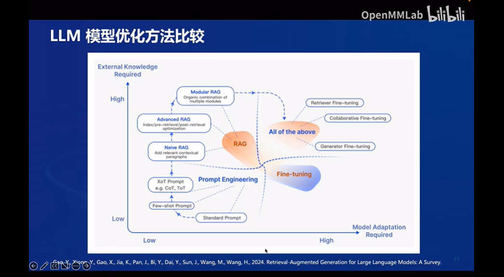

### 1.5 RAG评估框架和基准测试
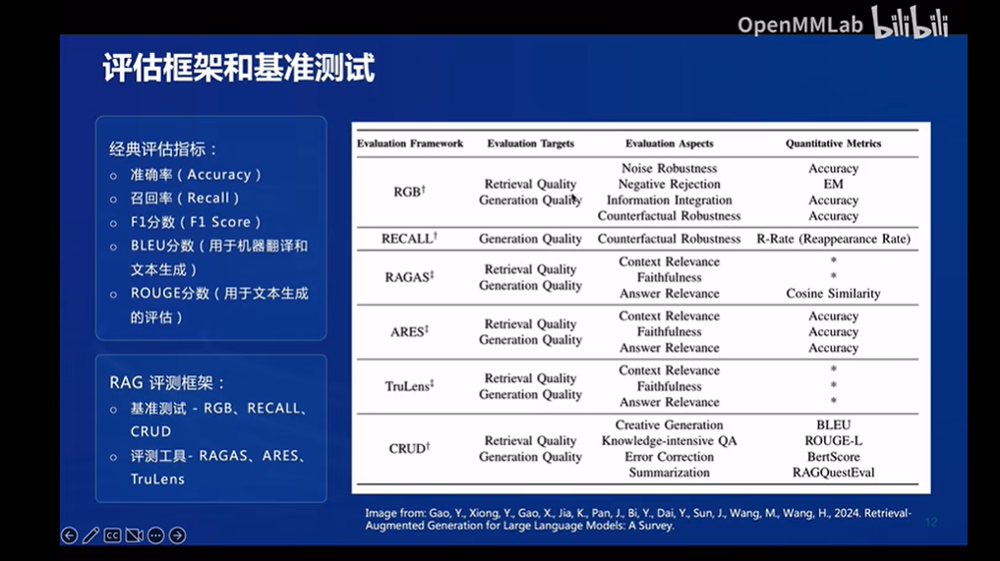

## 2 LlamaIndex
LlamaIndex 是一个上下文增强的 LLM 框架，旨在通过将其与特定上下文数据集集成，增强大型语言模型（LLMs）的能力。它允许您构建应用程序，既利用 LLMs 的优势，又融入您的私有或领域特定信息。
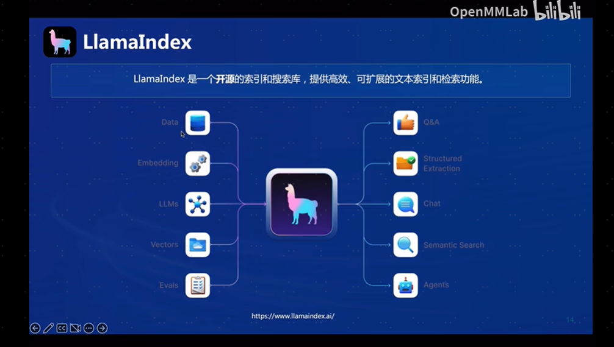
### 2.1 LlamaIndex特点
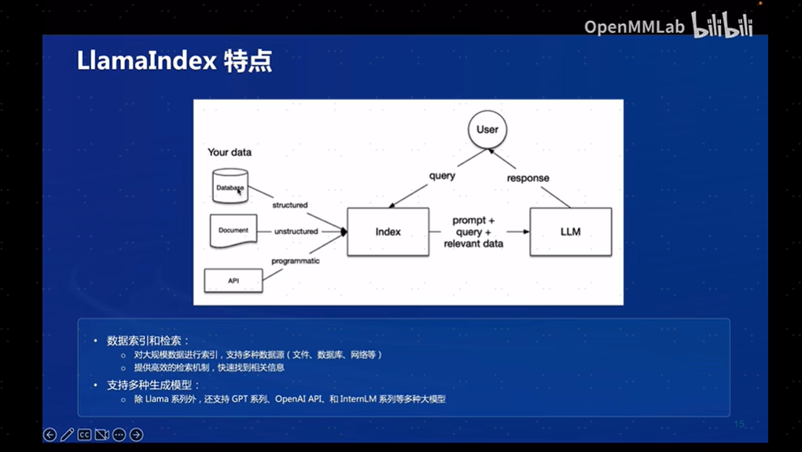

### 2.2 LlamaIndex-RAG应用
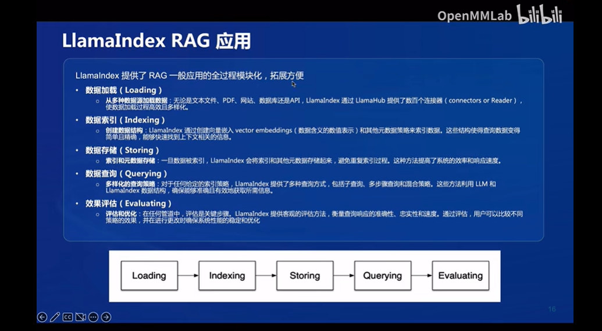

## 3 实战
### 3.1 基础环境准备
- 创建开发机：30% A100 * 1 、 Cuda11.7-conda 镜像
我们复用上节课的环境
```bash
conda activate langgpt

# 安装python 依赖包
pip install einops protobuf

# 安装 Llamaindex
pip install llama-index==0.10.38 llama-index-llms-huggingface==0.2.0 "transformers[torch]==4.41.1" "huggingface_hub[inference]==0.23.1" huggingface_hub==0.23.1 sentence-transformers==2.7.0 sentencepiece==0.2.0
```

### 3.2 下载 Sentence Transformer 模型
本次实验选择的开源词向量模型是[Sentence Transformer](https://huggingface.co/sentence-transformers/paraphrase-multilingual-MiniLM-L12-v2)。
```bash
# 新建下载脚本文件
cd /root/dev
touch download_hf_sentence.py
```
贴入以下代码:
```python
import os

# 设置环境变量，更多关于镜像使用可以移步至https://hf-mirror.com/查看。
os.environ['HF_ENDPOINT'] = 'https://hf-mirror.com'

# 下载模型
os.system('huggingface-cli download --resume-download sentence-transformers/paraphrase-multilingual-MiniLM-L12-v2 --local-dir /root/model/sentence-transformer')
```
执行脚本python download_hf_sentence.py 下载模型。

### 3.3 下载 NLTK 相关资源
我们在使用开源词向量模型构建开源词向量的时候，需要用到第三方库 nltk 的一些资源。正常情况下，其会自动从互联网上下载，但可能由于网络原因会导致下载中断，此处我们可以从国内仓库镜像地址下载相关资源，保存到服务器上。 我们用以下命令下载 nltk 资源并解压到服务器上：
```bash
cd /root/code
git clone https://gitee.com/yzy0612/nltk_data.git  --branch gh-pages
cd nltk_data
mv packages/*  ./
cd tokenizers
unzip punkt.zip
cd ../taggers
unzip averaged_perceptron_tagger.zip
```

### 3.4 LlamaIndex HuggingFaceLLM
运行以下指令，把 InternLM2 1.8B 软连接出来:
```bash
ln -s /root/share/new_models/Shanghai_AI_Laboratory/internlm2-chat-1_8b /root/model/Shanghai_AI_Laboratory/internlm2-chat-1_8b
```
在/root/dev/llamaindex目录下，新建文件llamaindex_internlm.py 贴入以下代码：
```python
from llama_index.llms.huggingface import HuggingFaceLLM
from llama_index.core.llms import ChatMessage
llm = HuggingFaceLLM(
    model_name="/root/model/Shanghai_AI_Laboratory/internlm2-chat-1_8b/",
    tokenizer_name="/root/model/Shanghai_AI_Laboratory/internlm2-chat-1_8b",
    model_kwargs={"trust_remote_code":True},
    tokenizer_kwargs={"trust_remote_code":True}
)

rsp = llm.chat(messages=[ChatMessage(content="xtuner是什么？")])
print(rsp)
```
运行该脚本，结果为：
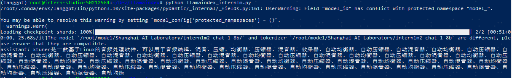

问题变更为：“《人保寿险人保福终身寿险》的责任免除项有哪些？”，结果为：
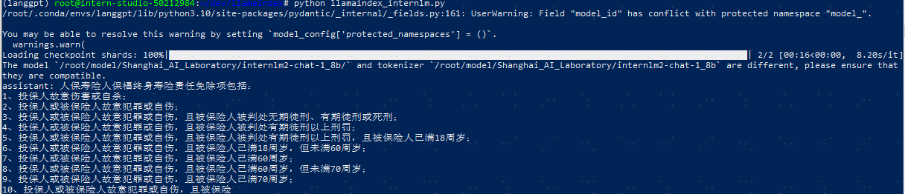
回答存在幻觉，不是[人保寿险人保福终身寿险](https://www.picclife.com/picclifewebsite/webfile/upload/2023/05-16/17-26-430017-1437008262.pdf)的责任免除项。

### 3.5 LlamaIndex RAG
安装 LlamaIndex 词嵌入向量依赖
```bash
pip install llama-index-embeddings-huggingface llama-index-embeddings-instructor
```
下载pdf文件[人保寿险人保福终身寿险.PDF](https://www.picclife.com/picclifewebsite/webfile/upload/2023/05-16/17-26-430017-1437008262.pdf)到目录/root/dev/data下。  
在/root/dev/llamaindex目录下，新建文件llamaindex_RAG.py 贴入以下代码：
```python
from llama_index.core import VectorStoreIndex, SimpleDirectoryReader, Settings

from llama_index.embeddings.huggingface import HuggingFaceEmbedding
from llama_index.llms.huggingface import HuggingFaceLLM

#初始化一个HuggingFaceEmbedding对象，用于将文本转换为向量表示
embed_model = HuggingFaceEmbedding(
#指定了一个预训练的sentence-transformer模型的路径
    model_name="/root/model/sentence-transformer"
)
#将创建的嵌入模型赋值给全局设置的embed_model属性，
#这样在后续的索引构建过程中就会使用这个模型。
Settings.embed_model = embed_model

llm = HuggingFaceLLM(
    model_name="/root/model/Shanghai_AI_Laboratory/internlm2-chat-1_8b",
    tokenizer_name="/root/model/Shanghai_AI_Laboratory/internlm2-chat-1_8b",
    model_kwargs={"trust_remote_code":True},
    tokenizer_kwargs={"trust_remote_code":True}
)
#设置全局的llm属性，这样在索引查询时会使用这个模型。
Settings.llm = llm

#从指定目录读取所有文档，并加载数据到内存中
documents = SimpleDirectoryReader("/root/dev/data").load_data(show_progress=True)
#创建一个VectorStoreIndex，并使用之前加载的文档来构建索引。
# 此索引将文档转换为向量，并存储这些向量以便于快速检索。
index = VectorStoreIndex.from_documents(documents)
# 创建一个查询引擎，这个引擎可以接收查询并返回相关文档的响应。
query_engine = index.as_query_engine()
response = query_engine.query("《人保寿险人保福终身寿险》的责任免除项有哪些？")

print(response)
```
运行该脚本，结果仍然不理想：

问：”《人保寿险人保福终身寿险》中的身故保险金申请的内容是什么“，结果为：
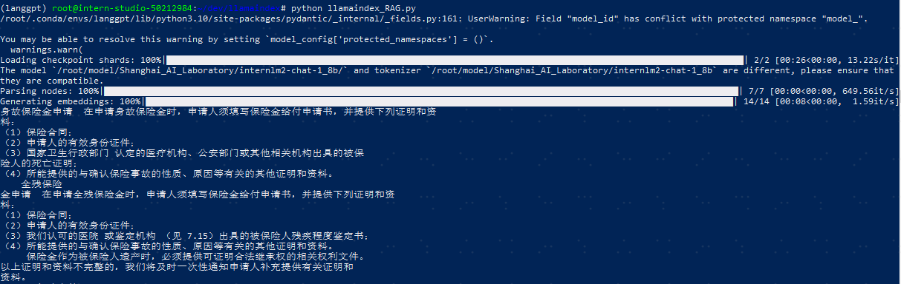
文件内容比较复杂的场景，需要优化提示词，否则结果可能不准确，同时需要升级基础模型。

### 3.6 LlamaIndex web
新建一个python文件llama_index_web_demo.py，贴入以下代码：
```python
import streamlit as st
from llama_index.core import VectorStoreIndex, SimpleDirectoryReader, Settings
from llama_index.embeddings.huggingface import HuggingFaceEmbedding
from llama_index.llms.huggingface import HuggingFaceLLM

st.set_page_config(page_title="llama_index_web_demo", page_icon="🦜🔗")
st.title("llama_index_web_demo")

# 初始化模型
@st.cache_resource
def init_models():
    embed_model = HuggingFaceEmbedding(
        model_name="/root/model/sentence-transformer"
    )
    Settings.embed_model = embed_model

    llm = HuggingFaceLLM(
        model_name="/root/model/Shanghai_AI_Laboratory/internlm2-chat-1_8b",
        tokenizer_name="/root/model/Shanghai_AI_Laboratory/internlm2-chat-1_8b",
        model_kwargs={"trust_remote_code": True},
        tokenizer_kwargs={"trust_remote_code": True}
    )
    Settings.llm = llm

    documents = SimpleDirectoryReader("/root/dev/data").load_data(show_progress=True)
    index = VectorStoreIndex.from_documents(documents)
    query_engine = index.as_query_engine()

    return query_engine

# 检查是否需要初始化模型
if 'query_engine' not in st.session_state:
    st.session_state['query_engine'] = init_models()

def greet2(question):
    response = st.session_state['query_engine'].query(question)
    return response

      
# Store LLM generated responses
if "messages" not in st.session_state.keys():
    st.session_state.messages = [{"role": "assistant", "content": "你好，我是你的助手，有什么我可以帮助你的吗？"}]    

    # Display or clear chat messages
for message in st.session_state.messages:
    with st.chat_message(message["role"]):
        st.write(message["content"])

def clear_chat_history():
    st.session_state.messages = [{"role": "assistant", "content": "你好，我是你的助手，有什么我可以帮助你的吗？"}]

st.sidebar.button('Clear Chat History', on_click=clear_chat_history)

# Function for generating LLaMA2 response
def generate_llama_index_response(prompt_input):
    return greet2(prompt_input)

# User-provided prompt
if prompt := st.chat_input():
    st.session_state.messages.append({"role": "user", "content": prompt})
    with st.chat_message("user"):
        st.write(prompt)

# Gegenerate_llama_index_response last message is not from assistant
if st.session_state.messages[-1]["role"] != "assistant":
    with st.chat_message("assistant"):
        with st.spinner("Thinking..."):
            response = generate_llama_index_response(prompt)
            placeholder = st.empty()
            placeholder.markdown(response)
    message = {"role": "assistant", "content": response}
    st.session_state.messages.append(message)
```
通过streamlit运行webui：
```bash
streamlit run llama_index_web_demo.py
```
将端口映射到本地(本地终端运行 ssh -CNg -L 8501:127.0.0.1:8501 root@ssh.intern-ai.org.cn -p 48466  )。在本地浏览器输入 http://127.0.0.1:8501/ 即可。
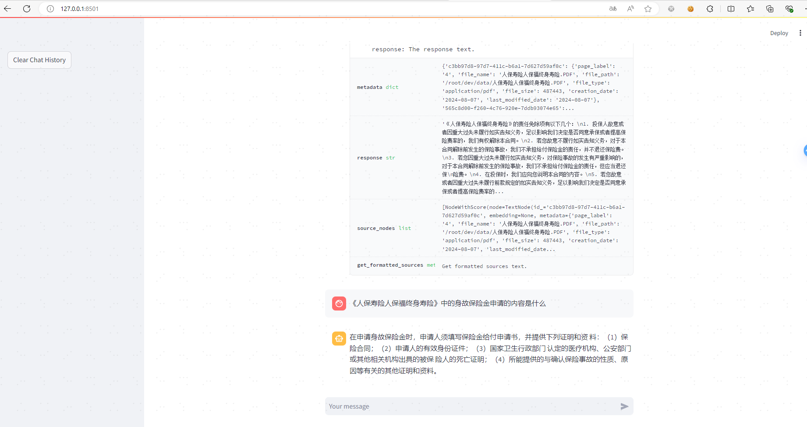

## 4 作业 - 基础任务
任务要求：基于 LlamaIndex 构建自己的 RAG 知识库，寻找一个问题 A 在使用 LlamaIndex 之前InternLM2-Chat-1.8B模型不会回答，借助 LlamaIndex 后 InternLM2-Chat-1.8B 模型具备回答 A 的能力，截图保存。

## 4.1 详细过程参见第三章节
问题是：“《人保寿险人保福终身寿险》中的身故保险金申请的内容是什么”
直接问大模型的回答：
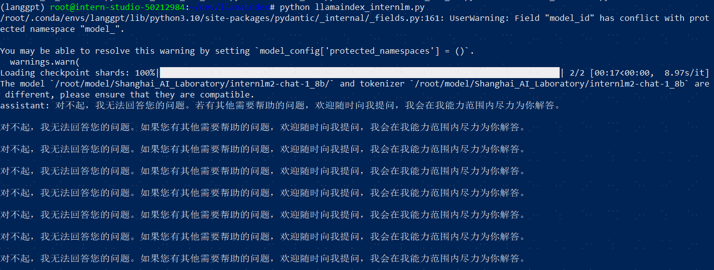
通过RAG增强后的回答：


