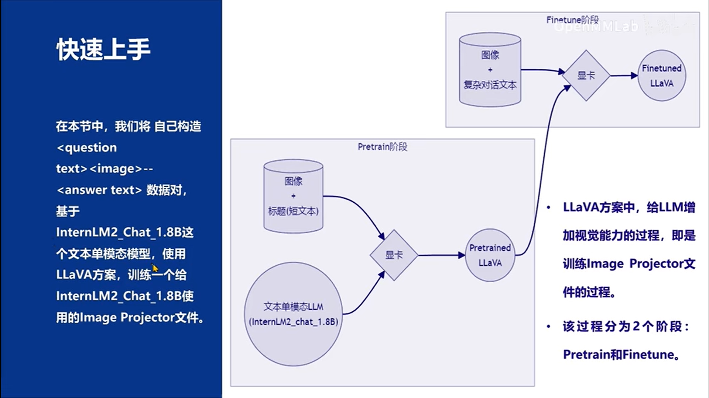
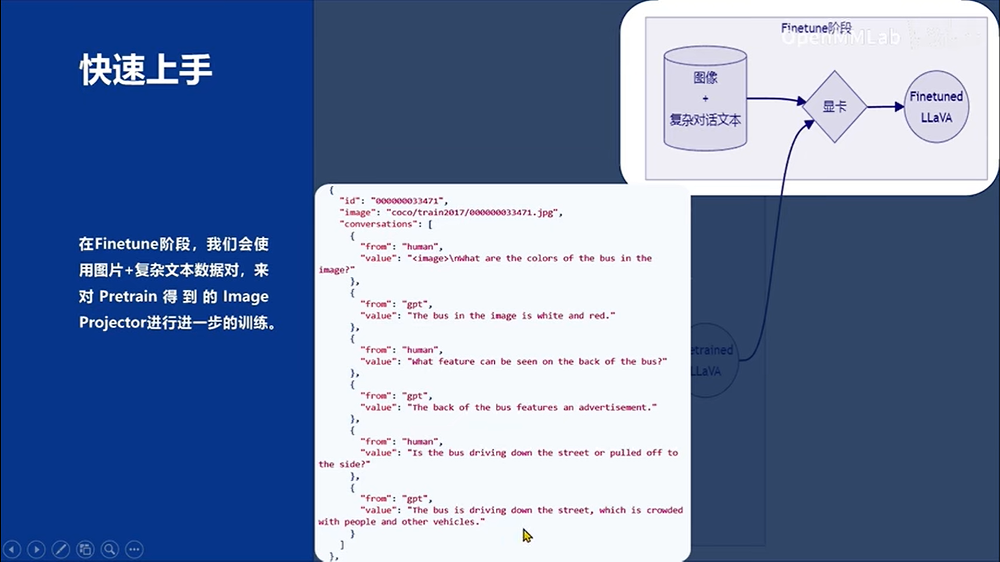

# XTuner微调个人小助手认知

## 1 微调的理论基础
### 1.1 大模型微调基本概念
微调（fine-tuning）是一种基于预训练模型，通过少量的调整（fine-tune）来适应新的任务或数据的方法。  
微调是在预训练模型的基础上，将模型中一些层的权重参数进行微调，以适应新的数据集或任务。  
预训练模型部分已经在大规模数据上得到了训练，它们通常是较为通用且高性能的模型，因此可以很好地作为新任务的起点。微调可以加快模型的收敛速度，降低模型过拟合的风险，并在不消耗过多计算资源的情况下获取较好的模型性能。
### 1.2 什么场景需要微调
通用大模型存在知识短板：垂域敏感数据不公开、私域数据难共享、行业经验难整合。关键知识和经验并没有被纳入通用模型的训练中， 所以模型微调的重点就是行业垂域数据。  
在进行微调时，重要的是要确保有足够的标注数据来指导模型学习，并且要考虑到微调可能需要的计算资源。此外，微调过程应该遵循数据隐私和伦理标准，确保数据的安全和合规性。  
常用的技术手段还有RAG。下表是RAG和指令微调的经典场景区别：

### 1.3 Finetune的两种范式

### 1.4 主流轻量化微调方法
- Prefix Tuning：与full fine-tuning更新所有参数的方式不同，该方法是在输入token之前构造一段任务相关的virtual tokens作为Prefix，然后训练的时候只更新Prefix部分的参数，而Transformer中的其他部分参数固定。该方法其实和构造Prompt类似，只是Prompt是人为构造的“显式”的提示,并且无法更新参数，而Prefix则是可以学习的“隐式”的提示。同时，为了防止直接更新Prefix的参数导致训练不稳定的情况，他们在Prefix层前面加了MLP结构(相当于将Prefix分解为更小维度的Input与MLP的组合后输出的结果)，训练完成后，只保留Prefix的参数。
- Prompt Tuning：该方法可以看作是Prefix Tuning的简化版本，只在输入层加入prompt tokens，并不需要加入MLP进行调整来解决难训练的问题。随着预训练模型参数量的增加，Prompt Tuning的方法会逼近fine-tuning的结果。
- P-Tuning：该方法主要是为了解决这样一个问题：大模型的Prompt构造方式严重影响下游任务的效果。P-Tuning将Prompt转换为可以学习的Embedding层，并用MLP+LSTM的方式来对prompt embedding进行一层处理。
- LoRA：LoRA（Low-Rank Adaptation）是一种使用低精度权重对大型预训练语言模型进行微调的技术，它的核心思想是在不改变原有模型权重的情况下，通过添加少量新参数来进行微调。这种方法降低了模型的存储需求，也降低了计算成本，实现了对大模型的快速适应，同时保持了模型性能。  
然而，由于使用了低精度权重，LoRA的一个潜在的缺点是在微调过程中可能会丢失一些原始模型的高阶特征信息，因此可能会降低模型的准确性。
- QLoRA：QLoRA（Quantized LoRA）微调技术是对LoRA的一种改进，它通过引入高精度权重和可学习的低秩适配器来提高模型的准确性。并且在LoRA的基础上，引入了量化技术。通过将预训练模型量化为int4格式，可以进一步减少微调过程中的计算量，同时也可以减少模型的存储空间，这对于在资源有限的设备上运行模型非常有用。最终，可以使我们在消费级的显卡上进行模型的微调训练。


### 1.5 微调数据集


## 2 XTuner微调工具箱
### 2.1 XTuner简介
XTuner 的官方仓库是：https://github.com/InternLM/xtuner ,项目是一个大语言模型&多模态模型微调工具箱。由 MMRazor 和 MMDeploy 联合开发。功能亮点：
- 适配多种生态
    - 支持多种微调算法
    - 适配多种开源生态（HuggingFace、ModelScope等）
    - 自动优化加速器
- 适配多种硬件  


### 2.2 XTuner常用命令
```bash
# 列出所有预定义配置文件， 参数 -p $NAME 可以指定配置文件$NAME进行模糊搜索
xtuner list-cfg

# 复制配置文件
xtuner copy-cfg $CONFIG $SAVE_PATH

# 执行微调训练：命令用于启动模型微调进程。该命令需要一个参数：CONFIG 用于指定微调配置文件。
xtuner train $CONFIG

# 将原始模型与微调结果进行合并，三个参数：LLM 表示原模型路径，ADAPTER 表示 Adapter 层的路径， SAVE_PATH 表示合并后的模型最终的保存路径。
xtuner convert merge $LLM $ADAPTER $SAVE_PATH
```
### 2.3 XTuner快速上手


### 2.4 XTuner数据引擎

### 2.5 XTuner优化技巧


## 3 XTuner工具包环境安装
### 3.1 创建开发机
新建--个人开发机--开发机名称：XTuner微调--镜像Cuda12.2-conda--资源配置选择10%A100（后续微调的时候在升级）  

### 3.2 创建虚拟环境
```bash
# 创建虚拟环境
conda create -n xtuner python=3.10 -y

# 激活虚拟环境（注意：后续的所有操作都需要在这个虚拟环境中进行）
conda activate xtuner

# 安装一些必要的库
conda install pytorch==2.1.2 torchvision==0.16.2 torchaudio==2.1.2 pytorch-cuda=12.1 -c pytorch -c nvidia -y
# 安装其他依赖
pip install transformers==4.39.3 streamlit==1.36.0

#下载代码仓库Tutorial
mkdir -p /root/code/Tutorial
git clone -b camp3  https://github.com/InternLM/Tutorial /root/code/Tutorial
```

### 3.3 安装 XTuner
```bash
# 下载XTuner
cd /root/code
git clone  https://github.com/InternLM/XTuner 

# 执行安装
cd XTuner/
pip install -e '.[deepspeed]'
# 验证安装结果
xtuner version
xtuner help
```

### 3.4 模型准备
InternStudio 在开发机中已经为我们提供了模型的本地文件，直接使用即可
```bash
ln -s /root/share/new_models/Shanghai_AI_Laboratory/internlm2-chat-1_8b /root/model/Shanghai_AI_Laboratory/internlm2-chat-1_8b
```
其他平台可以在通过 HuggingFace、OpenXLab 或者 Modelscope 进行模型的下载

### 3.5 微调前的模型对话
启动微调前的 internlm2-chat-1_8b 查看对话效果
```bash
streamlit run /root/code/Tutorial/tools/xtuner_streamlit_demo.py
```
配置端口映射（ssh -CNg -L 8501:127.0.0.1:8501 root@ssh.intern-ai.org.cn -p 42678 ）后，就可以在本地通过浏览器访问：http://127.0.0.1:8501 来进行对话了。


## 4 指令跟随微调


### 4.1 准备数据文件
为了让模型能够认清自己的身份，在询问它是谁的时候按照我们预期的结果进行回复，我们就需要通过在微调数据集中大量加入这样的数据。我们准备一个数据集文件datas/assistant.json，文件内容为对话数据。
```bash
cd /root/code/XTuner
mkdir -p datas
touch datas/assistant.json
```
为了简化数据文件准备，我们通过脚本生成的方式来准备数据。创建一个脚本文件xtuner_generate_assistant.py ：
```python
import json

# 设置用户的名字
name = '张三'
# 设置需要重复添加的数据次数
n =  3750

# 初始化数据
data = [
    {"conversation": [{"input": "请介绍一下你自己", "output": "我是{}的小助手，内在是上海AI实验室书生·浦语的1.8B大模型哦".format(name)}]},
    {"conversation": [{"input": "你在实战营做什么", "output": "我在这里帮助{}完成XTuner微调个人小助手的任务".format(name)}]}
]

# 通过循环，将初始化的对话数据重复添加到data列表中
for i in range(n):
    data.append(data[0])
    data.append(data[1])

# 将data列表中的数据写入到'datas/assistant.json'文件中
with open('/root/code/XTuner/datas/assistant.json', 'w', encoding='utf-8') as f:
    # 使用json.dump方法将数据以JSON格式写入文件
    # ensure_ascii=False 确保中文字符正常显示
    # indent=4 使得文件内容格式化，便于阅读
    json.dump(data, f, ensure_ascii=False, indent=4)

```
然后执行该脚本来生成数据文件。
```bash
python xtuner_generate_assistant.py
```


### 4.2 准备配置文件
在XTuner中，我们通过配置文件来指定微调的参数。在XTuner的官方仓库中，已经为我们提供了很多预定义的配置文件，我们可以直接使用。可以通过以下命令查看。
```bash
xtuner list-cfg -p internlm2_chat_1_8b
```

配置文件名的解释
  

复制一个预设的配置文件:  
```bash
xtuner copy-cfg internlm2_chat_1_8b_qlora_alpaca_e3 .
```
由于我们是对internlm2-chat-1_8b模型进行指令微调，所以与我们的需求最匹配的配置文件是 internlm2_chat_1_8b_qlora_alpaca_e3，这里就复制该配置文件。  

> xtuner copy-cfg 命令用于复制一个内置的配置文件。该命令需要两个参数：CONFIG 代表需要复制的配置文件名称，SAVE_PATH 代表复制的目标路径。在我们的输入的这个命令中，我们的 CONFIG 对应的是上面搜索到的 internlm2_chat_1_8b_qlora_alpaca_e3 ,而 SAVE_PATH 则是当前目录 .。

常用参数介绍：

### 4.3 对配置文件进行修改
```bash
cd /root/code/XTuner
cp /root/code/Tutorial/configs/internlm2_chat_1_8b_qlora_alpaca_e3_copy.py ./
```
调整模型路径：

### 4.4 启动XTuner微调
终端运行启动命令：
```bash
cd /root/code/XTuner
xtuner train ./internlm2_chat_1_8b_qlora_alpaca_e3_copy.py
```
xtuner train 命令用于启动模型微调进程。该命令需要一个参数：CONFIG 用于指定微调配置文件。这里我们使用修改好的配置文件 internlm2_chat_1_8b_qlora_alpaca_e3_copy.py。
训练过程中产生的所有文件，包括日志、配置文件、检查点文件、微调后的模型等，默认保存在 work_dirs 目录下，我们也可以通过添加 --work-dir 指定特定的文件保存位置。  


### 4.5 模型格式转换
模型转换的本质其实就是将原本使用 Pytorch 训练出来的模型权重文件转换为目前通用的 HuggingFace 格式文件，那么我们可以通过以下命令来实现一键转换。

> xtuner convert pth_to_hf 命令用于进行模型格式转换。该命令需要三个参数：CONFIG 表示微调的配置文件， PATH_TO_PTH_MODEL 表示微调的模型权重文件路径，即要转换的模型权重， SAVE_PATH_TO_HF_MODEL 表示转换后的 HuggingFace 格式文件的保存路径。  
除此之外，我们其实还可以在转换的命令中添加几个额外的参数，包括：
| 参数名 | 解释 |
|-------|-------|
| --fp32 | 代表以fp32的精度开启，假如不输入则默认为fp16 |
| --max-shard-size {GB} | 代表每个权重文件最大的大小（默认为2GB）|
```bash
cd /root/code/XTuner
# 先获取最后保存的一个pth文件
pth_file=`ls -t ./work_dirs/internlm2_chat_1_8b_qlora_alpaca_e3_copy/*.pth | head -n 1`
export MKL_SERVICE_FORCE_INTEL=1
export MKL_THREADING_LAYER=GNU
xtuner convert pth_to_hf ./internlm2_chat_1_8b_qlora_alpaca_e3_copy.py ${pth_file} ./hf
```

此时，hf 文件夹即为我们平时所理解的所谓 “LoRA 模型文件”。可以简单理解为：LoRA 模型文件 = Adapter。

### 4.6 模型合并
对于 LoRA 或者 QLoRA 微调出来的模型其实并不是一个完整的模型，而是一个额外的层（Adapter），训练完的这个层最终还是要与原模型进行合并才能被正常的使用。

> 对于全量微调的模型（full）其实是不需要进行整合这一步的，因为全量微调修改的是原模型的权重而非微调一个新的 Adapter ，因此是不需要进行模型整合的。
在 XTuner 中提供了一键合并的命令 xtuner convert merge，在使用前我们需要准备好三个路径，包括原模型的路径、训练好的 Adapter 层的（模型格式转换后的）路径以及最终保存的路径。

    xtuner convert merge命令用于合并模型。该命令需要三个参数：LLM 表示原模型路径，ADAPTER 表示 Adapter 层的路径， SAVE_PATH 表示合并后的模型最终的保存路径。
在模型合并这一步还有其他很多的可选参数，包括：
| 参数名 | 解释 |
|-------|-------|
| --max-shard-size {GB} | 代表每个权重文件最大的大小（默认为2GB）|
| --device {device_name} | 这里指的就是device的名称，可选择的有cuda、cpu和auto，默认为cuda即使用gpu进行运算 |
| --is-clip | 这个参数主要用于确定模型是不是CLIP模型，假如是的话就要加上，不是就不需要添加 |

```bash
cd /root/code/XTuner

export MKL_SERVICE_FORCE_INTEL=1
export MKL_THREADING_LAYER=GNU
xtuner convert merge /root/model/Shanghai_AI_Laboratory/internlm2-chat-1_8b ./hf ./merged --max-shard-size 2GB
```


### 4.7 微调后的模型对话
微调完成后，我们可以再次运行xtuner_streamlit_demo.py（复制一个文件xtuner_streamlit_demo-funetune.py）脚本来观察微调后的对话效果，不过在运行之前，我们需要将脚本中的模型路径修改为微调后的模型的路径。
```python
# 直接修改脚本文件第18行
- model_name_or_path = "/root/code/XTuner/Shanghai_AI_Laboratory/internlm2-chat-1_8b"
+ model_name_or_path = "/root/code/XTuner/merged"
```

启动微调后的模型 查看对话效果
```bash
streamlit run /root/code/Tutorial/tools/xtuner_streamlit_demo-funetune.py
```


## 5 作业 - 基础任务
使用 XTuner 微调 InternLM2-Chat-1.8B 实现自己的小助手认知，如下图所示（图中的伍鲜同志需替换成自己的昵称），记录复现过程并截图。

问答来看，过拟合比较严重，操作步骤详细过程详见第四章节


## 参考资料
- https://github.com/InternLM/Tutorial/blob/camp3/docs/L1/XTuner/xtuner_finetune_basic.md
- https://github.com/InternLM/Tutorial/tree/camp3/docs/L1/XTuner
